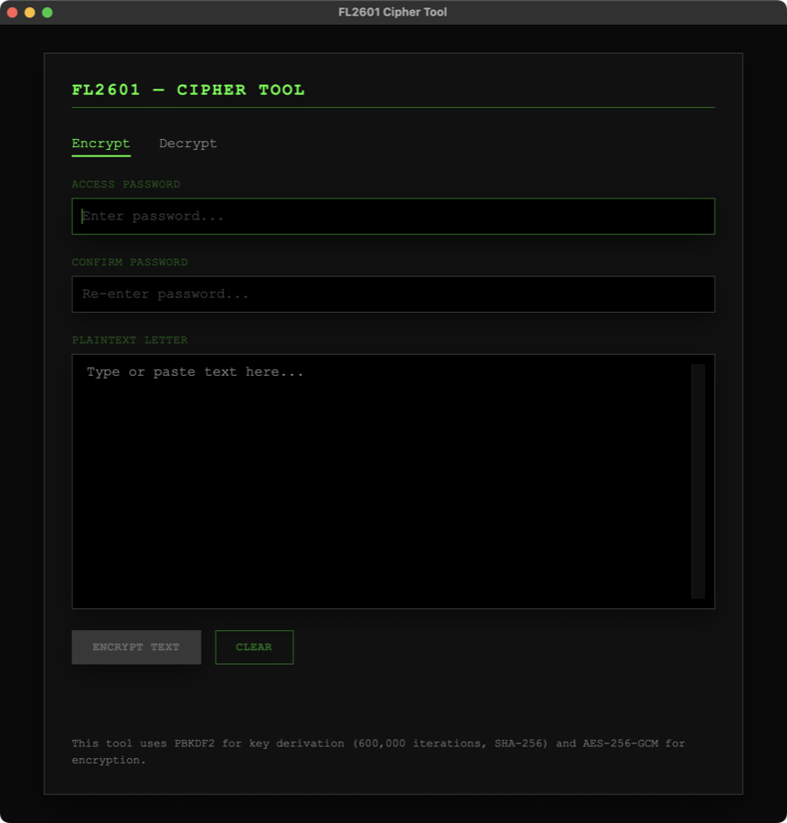

# FL2601 Cipher Tool
### Passphrase Text Encryption for macOS

<p align="center">
  <strong>PBKDF2 + AES-256-GCM, entirely offline</strong>
  <br />
  <strong>Version:</strong> 1.1
  <br />
  <a href="https://github.com/sevmorris/FL2601/releases/latest/download/FL2601-Cipher-Tool-1.1.dmg"><strong>Download Latest (DMG)</strong></a>
  ·
  <a href="https://sevmorris.github.io/FL2601/">Theory of Operation</a>
</p>

A small macOS app that encrypts text with a passphrase. Paste in a message,
enter a passphrase, and get back a block of base64 you can send over any
channel — email, chat, a screenshot, a printed page. Paste that base64 back in
with the same passphrase to recover the original.



## Why a native app

Browser-based "encrypt this text" tools ask you to trust that the page you
loaded today is the page you audited yesterday, and that it isn't quietly
sending your plaintext somewhere.

FL2601 runs under the App Sandbox with **no entitlements beyond the sandbox
itself** — in particular, no network access. It cannot open a connection even
if it wanted to; the sandbox forbids it. Nothing is written to disk either: no
preferences, no autosave, no recent-documents list. Text goes in through the
window, and out through the clipboard.

Requires macOS 15.0 or later. Universal — Apple silicon and Intel.

## Install

Download the DMG from the [Releases](../../releases) page, open it, and drag
the app to Applications. Builds are signed with a Developer ID certificate and
notarized by Apple, so they open without a Gatekeeper warning.

To build it yourself instead, see [Building](#building) below.

## Using it

**To encrypt:** enter a passphrase, confirm it in the second field, type or
paste your message, and press *Encrypt Text*. Copy the result and send it
however you like. It comes wrapped in a labelled block, so a recipient who has
never heard of this tool can tell what they are holding:

```
-----BEGIN FL2601 MESSAGE-----
Comment: Encrypted with FL2601 Cipher Tool
Comment: https://github.com/sevmorris/FL2601

RkwyNgEBAAknwJX5kSpGJS54IxUA7LVlb3ulUNz2+hmlKMKOoc2R8MwKuvL6K596
xSZPuCR0Ri1MyqOmw/nzm1TAeyZWjlkb/6KnTZkRUpFmVoc=
-----END FL2601 MESSAGE-----
```

The wrapper is presentation only — the payload between the markers is the
message, and deleting the surrounding lines leaves something any build can
read.

**To decrypt:** switch to the *Decrypt* tab, enter the passphrase, paste the
message, and press *Decrypt Text*. Paste the whole block or just the base64 —
both work. The confirmation field disappears here: a mistyped passphrase simply
fails to decrypt, so there is nothing for a second field to catch.

| Shortcut | Action |
| --- | --- |
| <kbd>⌘</kbd><kbd>↩</kbd> | Encrypt or decrypt |
| <kbd>⇧</kbd><kbd>⌘</kbd><kbd>C</kbd> | Copy the result |
| <kbd>⌘</kbd><kbd>⌫</kbd> | Clear everything |

Text pasted back in may carry line breaks, indentation, or stray whitespace —
from an email client that wrapped or quoted it, for example. That is handled.

**There is no passphrase recovery.** The passphrase is never stored anywhere,
by design. If you lose it, the message is gone. That is the point of the tool,
and it applies to you as much as to anyone else.

## How it works

Keys are derived with PBKDF2-HMAC-SHA256 at 600,000 iterations (OWASP's
current floor for SHA-256, about 70 ms per operation on Apple silicon).
Encryption is AES-256-GCM, which authenticates as well as encrypts: a modified
message fails to decrypt rather than decrypting to garbage.

The payload is versioned and self-describing: the key derivation parameters
travel with each message rather than living in a constant in the source, so the
work factor can be raised in a future release without stranding messages
encrypted today.

**[Theory of Operation](https://sevmorris.github.io/FL2601/)** documents the
[byte layout](https://sevmorris.github.io/FL2601/#payload), the
[threat model](https://sevmorris.github.io/FL2601/#threat), and the reasoning
behind both.

## Building and verifying

Requires Xcode 26 or later.

```bash
./build.sh          # Release build, signed and verified
./build.sh --debug  # Ad-hoc signed, no Developer ID certificate needed
```

```bash
./tools/differential-test.sh   # Format and crypto (requires node)
./tools/viewmodel-test.sh      # App logic
```

Both suites compile the app's real sources rather than copies, so they fail if
the shipping code drifts. The differential suite cross-checks the engine
against an independent WebCrypto implementation of the same format —
[why that matters](https://sevmorris.github.io/FL2601/#architecture).

## License

[GPL-3.0](LICENSE). If you distribute a modified version, you must publish
your source under the same terms — for a tool people are asked to trust with
their plaintext, that seems like the right default.
