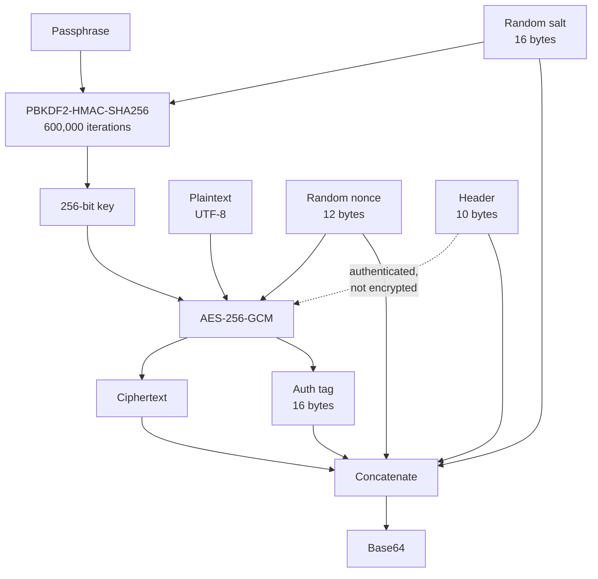
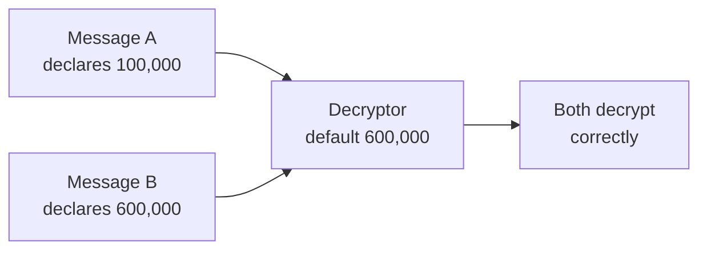
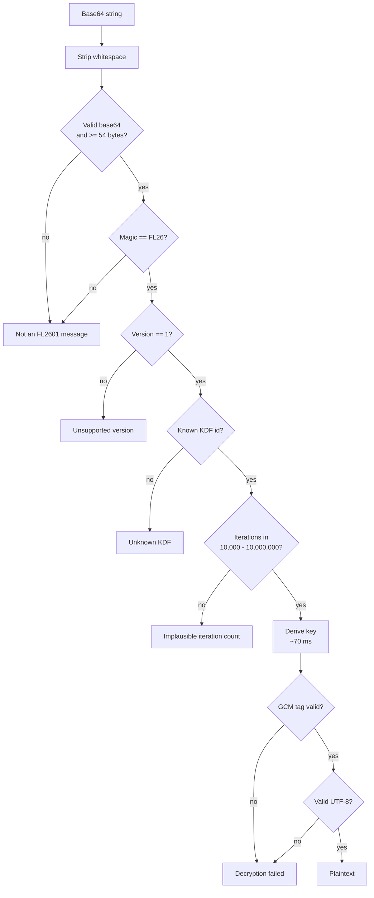

# Theory of Operation

How FL2601 Cipher Tool turns a passphrase and a message into a block of
base64, and how it turns that block back again. This document describes what
the code does and, where it matters, why it does it that way rather than some
other reasonable way.

The authoritative source is
[`Services/CipherEngine.swift`](../FL2601/FL2601/Services/CipherEngine.swift).
If this document and that file disagree, the file is right and this is a bug.

---

## 1. The problem

You have text you want to hand to someone over a channel you do not trust —
email, chat, a photograph of a screen — such that only a person who knows a
shared passphrase can read it.

That requires three things, and all three are easy to get subtly wrong:

1. **Turning a passphrase into a key.** People choose passphrases from a much
   smaller space than a 256-bit key occupies. The gap has to be made expensive
   to search.
2. **Encrypting with that key.** The result must reveal nothing about the
   plaintext, and encrypting the same message twice must not produce the same
   output.
3. **Detecting tampering.** Encryption alone does not stop someone flipping
   bits in transit. Without authentication, a modified ciphertext decrypts to
   modified plaintext, and you have no way to know.

Everything below follows from those three requirements.

---

## 2. The pipeline



Two random values are generated per message — a salt and a nonce — and both
travel with the output in the clear. Neither is secret. The salt exists so
that the same passphrase produces a different key every time; the nonce exists
so that the same key produces different ciphertext every time. Reusing either
would be a serious flaw, so both come from `SecRandomCopyBytes` on every call.

---

## 3. Key derivation

```
key = PBKDF2-HMAC-SHA256(passphrase, salt, iterations)   // 32 bytes
```

PBKDF2 is a deliberately slow function. The only reason to run 600,000 rounds
of HMAC instead of one is to impose that cost on somebody guessing
passphrases. A single derivation takes roughly 70 ms on Apple silicon —
unnoticeable when you press a button once, and a 600,000× multiplier on the
cost of a brute-force search.

600,000 is [OWASP's current
floor](https://cheatsheetseries.owasp.org/cheatsheets/Password_Storage_Cheat_Sheet.html)
for PBKDF2-HMAC-SHA256.

**Why PBKDF2 and not something better.** Argon2id and scrypt are memory-hard:
they resist GPU and ASIC attacks far better than PBKDF2, which parallelizes
cheaply. They are the better choice on the merits. Neither ships in Apple's
CryptoKit or CommonCrypto, so using one means vendoring a third-party
implementation of a primitive whose correctness is load-bearing. That trade —
a stronger KDF against an audited-by-Apple implementation and zero
dependencies — went to PBKDF2. Section 6 explains how that decision can be
revisited without breaking anything already encrypted.

The derivation drops to CommonCrypto's `CCKeyDerivationPBKDF`, since CryptoKit
exposes no PBKDF2. Derived key bytes are zeroed after the `SymmetricKey` copies
them. The passphrase itself is not wiped — Swift's `String` provides no way to
reach its storage — so that is a partial measure and is described as one.

---

## 4. Encryption

```
nonce ‖ ciphertext ‖ tag = AES-256-GCM(key, plaintext, aad: header)
```

AES-GCM is an authenticated cipher: it produces a 16-byte tag alongside the
ciphertext, and decryption verifies that tag before returning any plaintext.
A single flipped bit anywhere in the ciphertext, nonce, or tag causes
decryption to fail outright rather than return garbage.

CryptoKit's `AES.GCM.SealedBox.combined` is exactly `nonce ‖ ciphertext ‖ tag`,
so the engine concatenates the header and salt in front of it and does no
further framing of its own.

### The header is authenticated but not encrypted

The 10-byte header is passed to AES-GCM as *additional authenticated data*. It
is not encrypted — you can read the version and iteration count off any
message — but it is covered by the tag, so altering any of it makes decryption
fail.

This matters because the header tells the decryptor how to derive the key. Left
unauthenticated, it would be the one part of the message an attacker could
rewrite freely.

The salt is not in the AAD, and does not need to be: it feeds the key
derivation, so changing it produces a different key, which fails the tag check
on its own. Adding it to the AAD would be belt-and-braces with no additional
guarantee.

---

## 5. The payload

```
offset  size  field
     0     4  magic "FL26"
     4     1  format version
     5     1  KDF identifier (1 = PBKDF2-HMAC-SHA256)
     6     4  KDF iterations, big-endian uint32
    10    16  salt
    26    12  AES-GCM nonce
    38     n  ciphertext
38 + n    16  authentication tag
```

Bytes `0..<10` are the header. The whole structure is base64-encoded, which is
what you copy out of the app.

A payload is therefore always at least 54 bytes: 10 + 16 + 12 + 16, with `n`
of zero. That minimum is enforced literally — an empty message is a legitimate
thing to encrypt, and the length check uses `>=` rather than `>` so that a
zero-length ciphertext is accepted. An earlier revision used `>` and rejected
its own output for the empty string. The differential test suite covers it now.

---

## 6. Why the format describes itself

The iteration count travels *in the message*. It is not a constant the
decryptor assumes.

This is the single most consequential design decision in the project, and it
was made in response to a concrete failure in an earlier revision, which
hardcoded the count. In that design, raising the work factor from 100,000 to
600,000 would have made every previously encrypted message permanently
unreadable — the same passphrase and the same salt would derive a different
key, the tag check would fail, and the app would report *"Decryption failed.
Check password and ciphertext."* on a message with the correct passphrase. The
failure would have been indistinguishable from a typo.

Because the count is data rather than code, a decryptor reads how the key was
derived instead of guessing:



The test suite asserts exactly this: a payload written at 10,000 iterations
decrypts on an engine whose default is 600,000, without being told.

The KDF identifier at byte 5 extends the same idea to the algorithm. Adding
Argon2id later means allocating identifier `2` and teaching the decryptor to
switch on it. Messages written today keep declaring identifier `1` and keep
opening. The format version at byte 4 is the escape hatch for changes this
scheme cannot express — a different layout, or a different AAD rule.

---

## 7. Decryption, and one ordering problem



Whitespace is stripped before decoding, so base64 that an email client wrapped
across lines still pastes cleanly. This mirrors what browsers' `atob` does.

**The ordering problem.** Key derivation has to happen *before* the tag can be
checked — the tag check needs the key. So by the time authentication can reject
a hostile payload, the app has already spent whatever time that payload's
declared iteration count demanded. A message claiming 4.2 billion iterations
would be rejected eventually, but only after the app had stopped responding for
a very long time.

That is why the iteration count is range-checked against 10,000–10,000,000
before derivation runs. The bound is not a cryptographic control; it is the
thing standing between a malicious paste and an unresponsive app. The test
suite asserts both that such a payload is rejected and that the rejection takes
under two seconds.

### Why failures are vague on purpose

Everything from the tag check onward reports the same message:

> Decryption failed. Check password and ciphertext.

A wrong passphrase and a tampered message are *the same event* to AES-GCM. The
tag does not verify, and nothing in the failure distinguishes which cause
produced it. An app claiming to tell them apart would be guessing, and a
confident wrong guess — "your passphrase is correct, the message was
modified" — is worse than no information.

The checks *before* the tag are different in kind: they read unauthenticated
metadata, so they can report precisely what is malformed without implying
anything about the key.

---

## 8. Threat model

**Protects against.** Anyone who obtains the ciphertext without the
passphrase: they learn the message length (approximately), the format version,
and the iteration count, and nothing else. Anyone who modifies the ciphertext
in transit, including the header: the change is detected and decryption fails.
Offline guessing is slowed by a factor of 600,000 relative to a naive
passphrase check.

**Does not protect against.** A weak passphrase — 600,000 iterations multiplies
the attacker's cost, it does not create entropy that was never there, and a
dictionary word remains a dictionary word. Anything that can read the machine
while the app is running: the plaintext and passphrase are in memory by
necessity, and the sandbox does not defend against a local attacker who has
already won. Anyone who obtains the passphrase by any means outside this
program. Traffic analysis: the tool hides content, not the fact that you sent
something, nor roughly how long it was.

**Deliberately out of scope.** No key exchange — the passphrase reaches the
recipient by some other means, and that channel is your problem. No forward
secrecy: the same passphrase decrypts every message ever encrypted with it. No
identity or signing: a valid message proves someone knew the passphrase, not
who.

### What the sandbox buys

The app runs with `com.apple.security.app-sandbox` and nothing else. No network
entitlement, no file access, no hardware access.

The absence of a network entitlement is the substantive claim. It is enforced
by the kernel, not by the code's good intentions, and it holds even if the app
is compromised at runtime: there is no code path, intended or otherwise, that
can open a socket. For a tool asking you to type secrets into it, "cannot
exfiltrate" is a stronger property than "does not exfiltrate."

Nothing is written to disk — no preferences, no autosave, no recent documents.
Text enters through the window and leaves through the clipboard.

---

## 9. How the app is put together

Three layers, with the crypto deliberately isolated from both the UI and any
knowledge of it:

| Layer | Type | Responsibility |
| --- | --- | --- |
| [`CipherEngine`](../FL2601/FL2601/Services/CipherEngine.swift) | `actor` | Format, derivation, encryption. Knows nothing about the UI. |
| [`CipherViewModel`](../FL2601/FL2601/ViewModels/CipherViewModel.swift) | `@MainActor @Observable` | Field contents, validation, mode, status. Knows nothing about crypto beyond calling the engine. |
| [`ContentView`](../FL2601/FL2601/Views/ContentView.swift) | `View` | Layout and styling. Holds no logic worth testing. |

`CipherEngine` is an `actor` for a specific reason: 600,000 rounds of HMAC on
the main thread would freeze the window for the duration. As an actor its
methods run on the cooperative thread pool, and the view model awaits them from
the main actor.

The split is also what makes the app testable without a running UI. Both test
suites compile the real source files — not copies — and exercise them headlessly:

- [`tools/differential-test.sh`](../tools/differential-test.sh) cross-checks the
  engine against [`tools/reference-impl.mjs`](../tools/reference-impl.mjs), an
  independent implementation of the same format written against WebCrypto. Two
  unrelated crypto libraries agreeing on every byte is far stronger evidence
  than one implementation agreeing with itself, and it is how the empty-message
  length bug in section 5 was found.
- [`tools/viewmodel-test.sh`](../tools/viewmodel-test.sh) drives the view model
  through its states: validation, both flows, passphrase confirmation, mode
  switching, clipboard, and clear.

### Passphrase confirmation

Encryption asks for the passphrase twice; decryption asks once.

The asymmetry is not an oversight. When decrypting, a mistyped passphrase fails
loudly and immediately — the tag check catches it, and you try again. When
encrypting, a mistyped passphrase produces a *perfectly valid* message that
nobody can open, and you find out much later. The confirmation field exists
only where the mistake is silent and irreversible.

---

## 10. What would force a format change

Recorded so the answer is not re-derived later:

| Change | Version bump? |
| --- | --- |
| Different iteration count | No — it is already per-message data |
| Argon2id or scrypt | No — new KDF identifier at byte 5 |
| Different salt or nonce length | Yes — the geometry is fixed by version |
| Different AAD rule | Yes — silently changes what the tag covers |
| Compression before encryption | Yes |
| AES-256-GCM to ChaCha20-Poly1305 | Yes — the tag and nonce layout differ |

A version bump is not a disaster. Byte 4 exists precisely so a decryptor can
recognize a payload it cannot handle and say so, rather than deriving a key,
failing the tag check, and blaming the passphrase.
